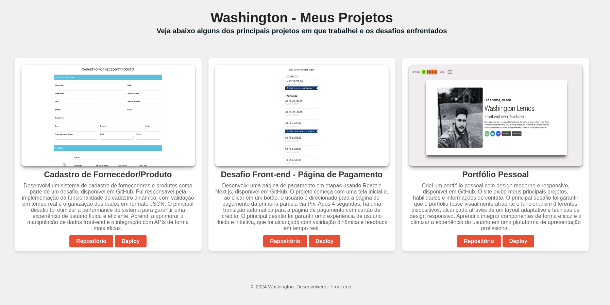

# Dev | Etapa de Análise de Portfólio

## Item 1 → Histórico de Projetos

### Para demonstrar alguns dos projetos em que trabalhei, criei uma página simples usando HTML e CSS. Esta página serve como um portfólio básico, exibindo detalhes e exemplos dos projetos que desenvolvi ao longo da minha carreira. Através dessa apresentação, é possível visualizar as minhas habilidades e o tipo de trabalho que realizo, proporcionando uma visão clara das minhas competências e experiência prática.

## Projeto 1 → Cadastro de Fornecedor/Produto

Desenvolvi um sistema de cadastro de fornecedores e produtos como parte de um desafio, disponível em GitHub. Fui responsável pela implementação da funcionalidade de cadastro dinâmico, com validação em tempo real e organização dos dados em formato JSON. O principal desafio foi otimizar a performance do sistema para garantir uma experiência de usuário fluida e eficiente. Aprendi a aprimorar a manipulação de dados front-end e a integração com APIs de forma mais eficaz.

Você pode ver o sistema em funcionamento através do [deploy](https://vflows-teste.vercel.app/).

## Projeto 2 → Desafio Front-end - Página de Pagamento

Desenvolvi uma página de pagamento em etapas usando React e Next.js, disponível em GitHub. O projeto começa com uma tela inicial e, ao clicar em um botão, o usuário é direcionado para a página de pagamento da primeira parcela via Pix. Após 4 segundos, há uma transição automática para a página de pagamento com cartão de crédito. O principal desafio foi garantir uma experiência de usuário fluida e intuitiva, que foi alcançada com validação dinâmica e feedback em tempo real.

Você pode ver o sistema em funcionamento através do [deploy](https://desafio-front-end-woovi-kappa.vercel.app/).

## Item 2 →  Git / Repositório

## Projeto 3 → Portfólio Pessoal

Criei um portfólio pessoal com design moderno e responsivo, disponível em GitHub. O site exibe meus principais projetos, habilidades e informações de contato. O principal desafio foi garantir que o portfólio fosse visualmente atraente e funcional em diferentes dispositivos, alcançado através de um layout adaptativo e técnicas de design responsivo. Aprendi a integrar componentes de forma eficaz e a otimizar a experiência do usuário em uma plataforma de apresentação profissional.

Você pode ver o sistema em funcionamento através do [deploy](https://new-portfolio-five-indol.vercel.app/).

